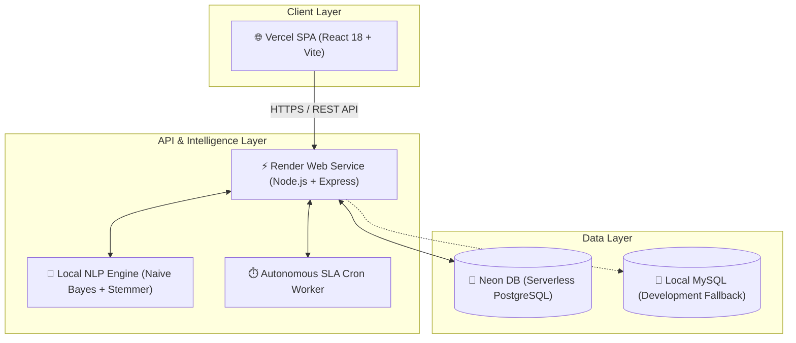
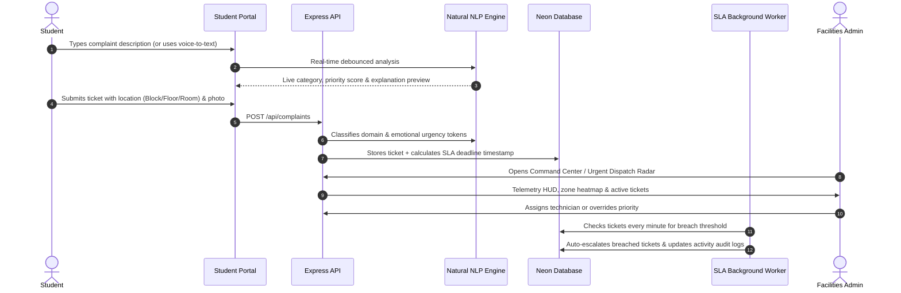

# 👁️ Campus-Eye
> **Autonomous Smart Campus Grievance Intelligence & Facilities Surveillance Command Center**

[](https://campus-eyes-w82a.vercel.app/)
[](https://github.com/yashasgowdacr/campus-eyes)


[](https://campus-eyes-w82a.vercel.app/)


---

## 🌐 Live Access & Demo Credentials

Access the live cloud deployment directly in your browser:  
👉 **[https://campus-eyes-w82a.vercel.app/](https://campus-eyes-w82a.vercel.app/)**

| Portal | Username | Password | Role & Permissions |
| :--- | :--- | :--- | :--- |
| **[Admin Command Center](https://campus-eyes-w82a.vercel.app/)** | `admin` | `admin` | Operations HUD, Heatmaps, Urgency Radar, SLA Escalations, AI Model Training |
| **[Student Portal](https://campus-eyes-w82a.vercel.app/)** | `student` | `student123` | Complaint Submission, Voice Input, Real-Time AI Suggestion, Profile Points |

*(New student accounts can also be created instantly via the Register tab).*

---

## 🏛️ System Architecture

Campus-Eye operates on a high-availability, zero-cost cloud architecture:



- **Frontend (Vercel):** Single-page application built with React 18, Vite, Lucide Icons, and Recharts.
- **Backend (Render):** Express API providing complaint triage, live timeline auditing, and continual NLP training.
- **AI Intelligence ($0 Cost):** Offline statistical NLP classifier (Multinomial Naive Bayes + Porter Stemmer) running in-memory with < 50MB RAM footprint.
- **Database (Neon DB / PostgreSQL):** Dual-engine connection pool supporting cloud serverless PostgreSQL with automatic schema migration and fallback to local MySQL.

---

## 🔄 Workflow Steps Taken to Build Campus-Eye



### 1. Ingestion & Multi-Modal Input
Students register grievances via text or browser voice-to-text, attaching location metadata (Block, Floor, Room) and optional image evidence.

### 2. Live Zero-Cost AI Classification
As the student types, the localized NLP engine analyzes linguistic tokens, evaluates urgency triggers (`fire`, `urgent`, `asap`, `leak`), scores sentiment, and recommends the category and priority in real-time.

### 3. Dynamic Incident Triage & Telemetry Radar
Submitted grievances enter the Command Center with SLA countdown clocks (`⏱️ 42m remaining` / `⚠️ Breached`). Critical incidents are highlighted on the pulsing Urgent Dispatch Radar.

### 4. Zone Hotspot Heatmap
Facilities managers visualize issue density across campus blocks in real-time, allowing maintenance teams to address root-cause infrastructure failures before escalating.

### 5. Autonomous SLA Worker & Audit Trail
A background worker (`node-cron`) audits active tickets every 60 seconds. Breached deadlines are automatically flagged as `escalated`, auto-reassigned if inactive, and permanently recorded in immutable activity logs.

---

## 🛠️ Technology Stack

| Layer | Technologies |
| :--- | :--- |
| **Frontend** | React 18, Vite, Lucide Icons, Recharts, Date-fns, Vanilla Modern CSS |
| **Backend** | Node.js, Express, `node-cron`, `cors`, `dotenv` |
| **AI / NLP** | `natural` (Multinomial Naive Bayes, Porter Stemmer, Tokenizer) — $0 API cost |
| **Database** | PostgreSQL (Neon Cloud) / MySQL 8.0, connection pooling, automated schema migration |
| **Hosting** | Vercel (Frontend SPA) + Render (Backend Web Service) |

---

## ⚡ Quick Local Launch

```bash
# 1. Clone repository
git clone https://github.com/yashasgowdacr/campus-eyes.git
cd campus-eyes

# 2. Start both frontend & backend with one command
chmod +x run.sh
./run.sh
```


---

## 📄 License
MIT License
